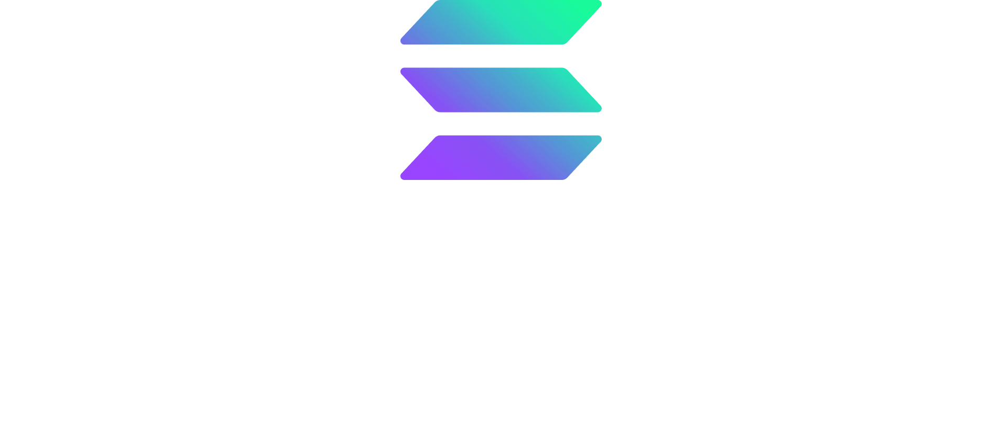

<div align="center">
 
 <h2>SOLANA PROGRAMS</h2>
</div>

## Repository Structure

Each program is organized in its own dedicated folder with a clear naming convention:
- For Anchor framework programs: `anchor-[programname]`
- For native Solana programs: `native-[programname]`
- For general notation of framework programs: `[framework]-[programname]`

### Programs Included

| Program | Framework | Description |
|---------|-----------|-------------|
| anchor-amm | Anchor | Automated Market Maker implementation with liquidity pools |
| anchor-collateral-stablecoin | Anchor | Collateralized stablecoin system with minting/burning mechanics |
| anchor-counter | Anchor | Simple counter program (ideal for beginners) |
| anchor-escrow | Anchor | Escrow service for secure token exchanges between parties |
| anchor-nft-marketplace | Anchor | NFT marketplace with listing, buying, and trading functionality |
| anchor-staking | Anchor | Token staking mechanism with rewards distribution |
| anchor-vault | Anchor | Secure token vault implementation for asset management |
| anchor-magicblock | Anchor | Realtime Transaction using Magicblock Ephemeral Rollups |

## Prerequisites

Before working with these programs, ensure you have the following installed:

- **Solana CLI** - [Installation Guide](https://docs.solana.com/cli/install-solana-cli-tools)
- **Rust** - [Installation Guide](https://www.rust-lang.org/tools/install)
- **Anchor** - For Anchor framework programs ([Installation Guide](https://www.anchor-lang.com/docs/installation))
- **Node.js** - For deployment and testing scripts

## Getting Started

1. Clone the repository:
```bash
git clone https://github.com/andi-nugroho/solana-programs.git
cd solana-programs
```

2. Set up your Solana environment:
```bash
solana config set --url localhost
solana-keygen new
```

3. Navigate to individual program directories:
```bash
cd anchor-[programname]
```

4. Follow specific program `README.md` instructions for detailed setup and usage.

## Building Programs

### For Anchor programs:
```bash
cd anchor-[programname]
anchor build
```

### For native Solana programs:
```bash
cd native-[programname]
cargo build-sbf
```

## Testing

Each program includes its own test suite. Refer to individual program documentation for specific testing instructions.

### General testing approach:
```bash
# For Anchor programs
anchor test

# For native programs
cargo test-sbf
```

## Deployment

To deploy programs to different Solana clusters:

```bash
# Deploy to devnet
anchor deploy --provider.cluster devnet

# Deploy to mainnet (use with caution)
anchor deploy --provider.cluster mainnet
```

## Contributing

We welcome contributions! Please read our [CONTRIBUTING.md](CONTRIBUTING.md) for details on our code of conduct and the process for submitting pull requests.

## License

This project is licensed under the MIT License - see the [LICENSE](LICENSE) file for details.

## Resources

- [Solana Documentation](https://docs.solana.com/)
- [Anchor Framework Documentation](https://www.anchor-lang.com/)
- [Solana Cookbook](https://solanacookbook.com/)
